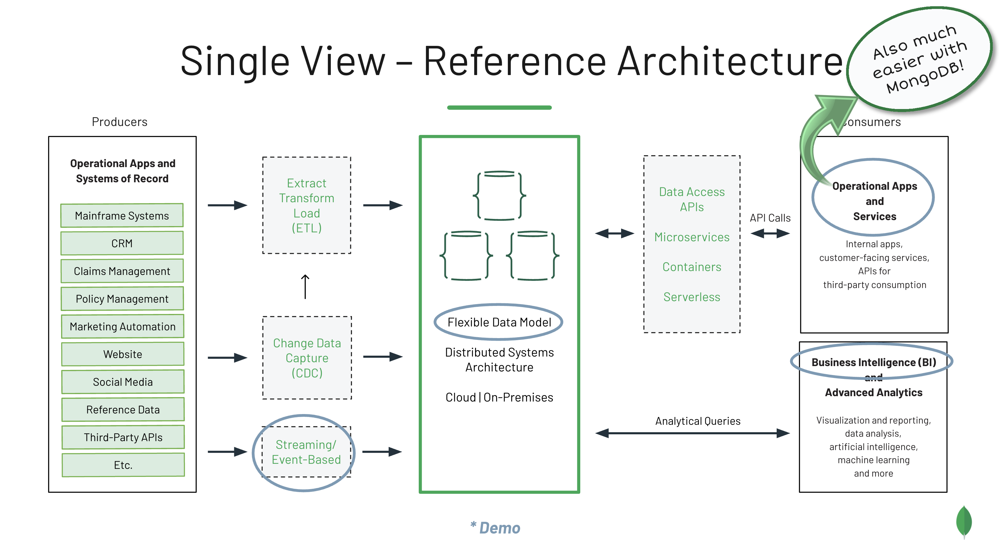
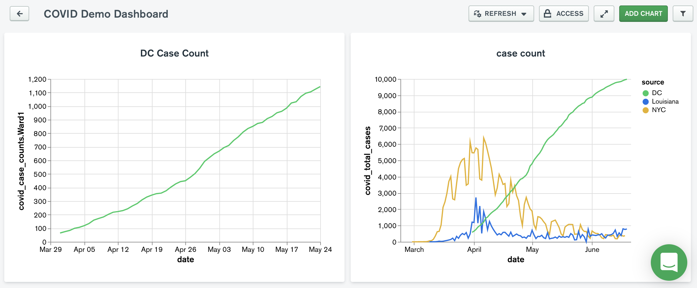

# Self-Service Data Access (Single View)

A full video of this demonstration is available here: <http://bit.ly/self-service-data-access-with-mongodb>

Provide your internal and external customers with self-service access to wide-ranging data sets by creating a single-view system with MongoDB. A reference architecture for such a system appears below, with the demonstration components circled in blue. 

Data is streamed in from the source systems (a json data set for this demo) using the MongoDB Kafka Connector. The flexible MongoDB data model accommodates COVID data being reported in three different formats. This data can then be analyzed in any number of ways, including MongoDB Compass and MongoDB Charts (shown below). Note that analysts have access to both the subset of standardized data as well as the source-specific details that are unique to that data provider.

